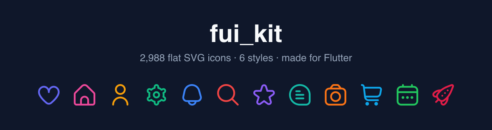
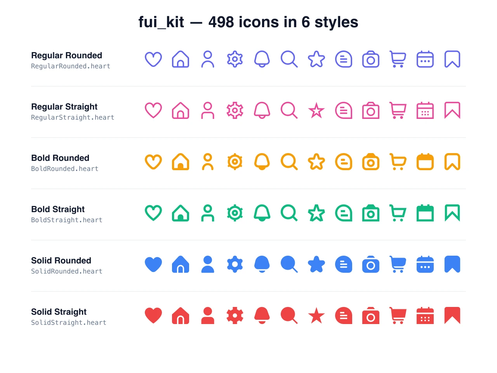

# fui_kit — Flat UI icons for Flutter



[](https://pub.dev/packages/fui_kit)
[](https://pub.dev/packages/fui_kit/score)
[](https://pub.dev/packages/fui_kit/score)
[](https://github.com/baldomerocho/fui_kit/blob/master/LICENSE)
[](https://codecov.io/gh/baldomerocho/fui_kit)
[](https://github.com/baldomerocho/fui_kit/actions/workflows/test.yaml)

**fui_kit** is a flat icon pack for Flutter with **2,988 SVG icons** — 498
unique glyphs in **6 styles** (regular, bold and solid weights, each with
rounded or straight corners), based on the open source
[Flaticon UIcons](https://www.flaticon.com/uicons/interface-icons) set.

- 🎨 **Themeable** — icons follow your app's `IconTheme` (light/dark mode
  works out of the box).
- ♿ **Accessible** — first-class `semanticLabel` support for screen readers.
- 🔍 **Searchable** — browse every icon in the
  [interactive gallery](https://baldomerocho.github.io/fui_kit/).
- 🧩 **Drop-in** — works anywhere a widget fits: `IconButton`, `AppBar`,
  `ListTile`, `BottomNavigationBar`…



## Installation

```sh
flutter pub add fui_kit
```

Or add it to your `pubspec.yaml` manually:

```yaml
dependencies:
  fui_kit: ^2.1.0
```

## Quick start

```dart
import 'package:flutter/material.dart';
import 'package:fui_kit/fui_kit.dart';

class MyWidget extends StatelessWidget {
  const MyWidget({super.key});

  @override
  Widget build(BuildContext context) {
    return const FUI(RegularRounded.heart);
  }
}
```

Use it like any other icon widget:

```dart
IconButton(
  onPressed: () {},
  icon: const FUI(BoldRounded.settings),
)
```

```dart
ListTile(
  leading: const FUI(SolidRounded.user, semanticLabel: 'Profile'),
  title: const Text('Profile'),
)
```

## The 6 styles

Every glyph exists in all six styles. Pick the class that matches the look
you want:

| Style            | Class             | Example                          |
|------------------|-------------------|----------------------------------|
| Regular Rounded  | `RegularRounded`  | `FUI(RegularRounded.bookmark)`   |
| Regular Straight | `RegularStraight` | `FUI(RegularStraight.bookmark)`  |
| Bold Rounded     | `BoldRounded`     | `FUI(BoldRounded.bookmark)`      |
| Bold Straight    | `BoldStraight`    | `FUI(BoldStraight.bookmark)`     |
| Solid Rounded    | `SolidRounded`    | `FUI(SolidRounded.bookmark)`     |
| Solid Straight   | `SolidStraight`   | `FUI(SolidStraight.bookmark)`    |

Icon names are lowerCamelCase versions of the original kebab-case Flaticon
names: `address-book` → `RegularRounded.addressBook`.

## Customization

```dart
FUI(
  SolidRounded.heart,
  color: Colors.red,          // defaults to IconTheme color
  width: 40,                  // defaults to IconTheme size (24)
  height: 40,
  semanticLabel: 'Favorite',  // announced by screen readers
)
```

| Parameter            | Type      | Default                | Description                                  |
|----------------------|-----------|------------------------|----------------------------------------------|
| `file` (positional)  | `String`  | required               | Icon constant, e.g. `RegularRounded.add`     |
| `color`              | `Color?`  | `IconTheme` color      | Tint applied to the icon                     |
| `width` / `height`   | `double?` | `IconTheme` size (24)  | Rendered size                                |
| `semanticLabel`      | `String?` | `null`                 | Accessibility label                          |
| `fit`                | `BoxFit`  | `BoxFit.contain`       | How the icon fills its bounds                |
| `matchTextDirection` | `bool`    | `false`                | Mirror the icon in RTL locales               |

### Theming and dark mode

`FUI` resolves its color and size from the ambient
[`IconTheme`](https://api.flutter.dev/flutter/widgets/IconTheme-class.html),
exactly like Flutter's built-in `Icon` widget. That means icons
automatically switch color with your `ThemeData` in light/dark mode, and you
can restyle entire subtrees at once:

```dart
IconTheme(
  data: const IconThemeData(color: Colors.teal, size: 32),
  child: Row(
    children: const [
      FUI(RegularRounded.home),
      FUI(RegularRounded.search),
      FUI(RegularRounded.bell),
    ],
  ),
)
```

## Browse all icons

- 🔎 **[Interactive gallery](https://baldomerocho.github.io/fui_kit/)** —
  search all 2,988 icons and copy the code snippet with one tap.
- 📚 **[API reference](https://pub.dev/documentation/fui_kit/latest/)** —
  every constant is documented.
- 🧰 **Programmatically** — each style class exposes an `all` map
  (kebab-case name → asset path), and `FuiIcons.styles` aggregates the six
  styles. Handy for building your own icon picker:

```dart
// All Regular Rounded icons:
for (final entry in RegularRounded.all.entries) {
  print('${entry.key} -> ${entry.value}');
}

// Every style:
FuiIcons.styles.forEach((styleName, icons) {
  print('$styleName has ${icons.length} icons');
});
```

## Migrating from 2.0.x

Nothing breaks — your existing code keeps compiling. Two things were
modernized in 2.1.0:

1. **Icon constants are now lowerCamelCase.** The old SCREAMING_CASE
   constants still work but are deprecated and will be removed in 4.0.0:

   ```dart
   FUI(RegularRounded.ADDRESS_BOOK) // deprecated
   FUI(RegularRounded.addressBook)  // ✅ use this
   ```

2. **Icons now follow your theme.** When you don't pass a `color`, the icon
   uses the ambient `IconTheme` color (previously it was tinted grey), and
   the default size honours `IconTheme.size` (24 in Material apps,
   previously a fixed 30). Pass `color`/`width`/`height` explicitly if you
   need the old values.

## FAQ

**Why don't I see the icon I expect?**
Check the [gallery](https://baldomerocho.github.io/fui_kit/) — names follow
the original Flaticon UIcons naming. The same glyph exists in all 6 styles.

**Can I use these icons commercially?**
Yes. The package code is MIT licensed and the icons come from Flaticon's
open source [UIcons](https://www.flaticon.com/uicons/interface-icons)
collection. See the attribution note below.

**How big is the package?**
The package bundles all 2,988 SVGs (~12 MB uncompressed) as Flutter assets.
A future 3.0.0 release will ship the icons as icon fonts with full
tree-shaking, so only the icons you use end up in your app binary. Follow
[the roadmap](https://github.com/baldomerocho/fui_kit/issues) for progress.

## License and attribution

- Source code: [MIT License](https://github.com/baldomerocho/fui_kit/blob/master/LICENSE)
  © Baldomero Cho.
- Icons: [UIcons](https://www.flaticon.com/uicons/interface-icons) by
  [Flaticon](https://www.flaticon.com), used under their open source/free
  license. If you redistribute the icons outside this package, review
  Flaticon's license terms.

## Contributing

Found a bug or want a new feature? Open an issue or a pull request on
[GitHub](https://github.com/baldomerocho/fui_kit). If this package saves you
time, a ⭐ on GitHub and a 👍 on
[pub.dev](https://pub.dev/packages/fui_kit) help others discover it.
